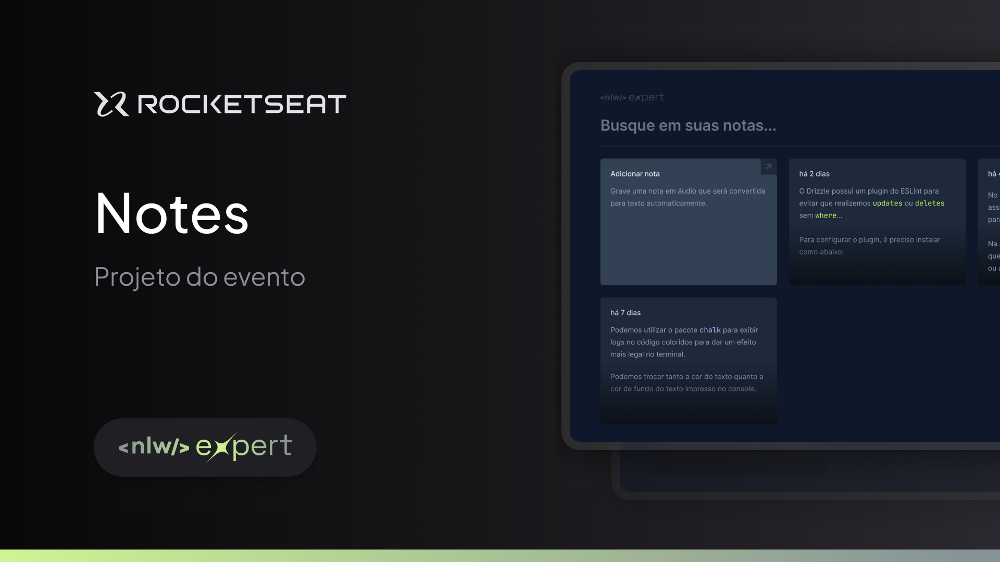

<h1 align="center"> Notes </h1>

<p align="center"> Project carried out during the NLW Expert ReactJS Track event offered by Rocketseat for teaching WEB technologies. <br/>
</p>
<p align="center">Visit the project online <a href="https://notes-three-sage.vercel.app/">by clicking here!</a></p>


<p align="center">
  
</p>

<br>

<p align="center">
   
</p>


# 💡 Technologies
Technologies used in the project:

* [ReactJS](https://react.dev/)      
* [TypeScript](https://www.typescriptlang.org/)      
* [TailwindCSS](https://tailwindcss.com/)  

# 🚀 Features

* Registration of new note.
* Audio note recording and automatic text transcription.
* Search for notes.

# 💻 Run the project
```bash
# Clone repository
$ git clone https://github.com/gabriellytegon/Notes.git
```

```bash
# Install Dependencies
$ npm install

# Run Aplication
$ npm run dev
```